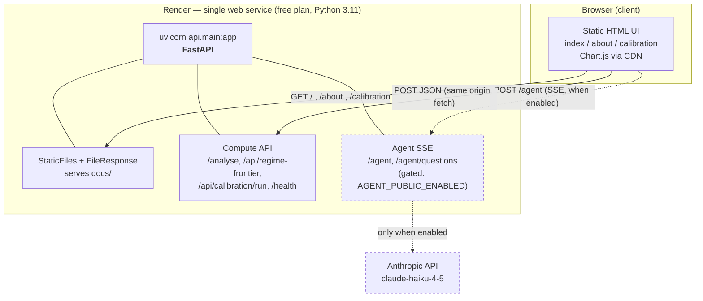
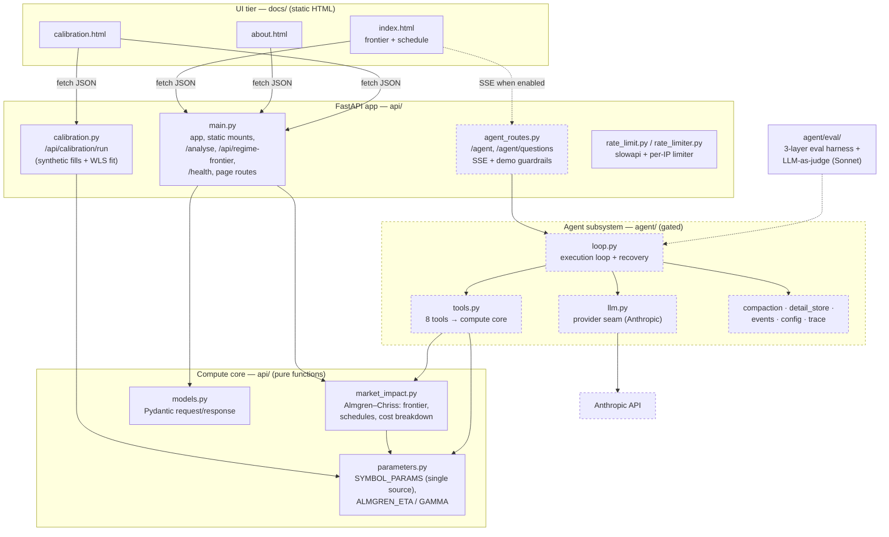
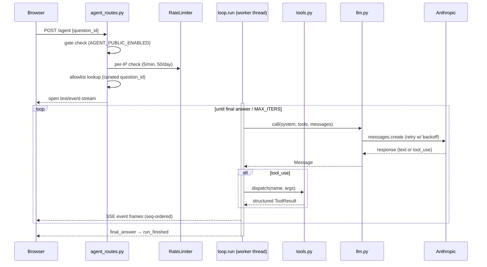

# FrontierView — Architecture

> **Status:** golden source. This document is the canonical description of how
> FrontierView is structured, deployed, and served. Any HTML or slide rendering
> of the architecture must be regenerated from this file — do not edit a
> rendered copy directly.

FrontierView is a pre-trade **market-impact analysis** tool built on the
Almgren–Chriss (2005) model. It computes efficient frontiers, execution
schedules, and impact decompositions, demonstrates parameter calibration, and
exposes an optional LLM agent that answers execution questions by calling the
same compute core.

---

## TL;DR

- **One process, three layers.** A single FastAPI app (`api.main:app`) serves
  the **static HTML UI**, the **JSON compute API**, and an optional
  **SSE streaming agent** — all from the same origin.
- **No separate frontend deployment.** The "frontend" is three hand-written
  HTML files in [`docs/`](docs/) (no build step, no framework, Chart.js via
  CDN). FastAPI mounts and serves them directly.
- **Single deploy target:** one Render web service (free plan, Python 3.11),
  started with `uvicorn api.main:app`.
- **The agent reuses the compute core.** Agent tools import from
  [`api/market_impact.py`](api/market_impact.py) and
  [`api/parameters.py`](api/parameters.py) — there is no second model.
- **The agent is gated off by default** (`AGENT_PUBLIC_ENABLED` unset → both
  agent routes return 404).

---

## Deployment view

There is exactly one deployable unit. The browser talks to a single origin;
that origin is the FastAPI app, which serves both the UI assets and the API.
The only external dependency at runtime is the Anthropic API, and only when the
agent is enabled.



**Deployment manifest** — [`render.yaml`](render.yaml):

| Field | Value |
|-------|-------|
| Service type | `web` (single service) |
| Runtime | `python`, `PYTHON_VERSION=3.11.0` |
| Build | `pip install -r requirements.txt` |
| Start | `uvicorn api.main:app --host 0.0.0.0 --port $PORT` |
| Plan | `free` (note: free dynos spin down when idle — see *Operational notes*) |

---

## Where the UI/server boundary actually is

The UI/server split is **logical, not physical**. Both halves ship in the same
repo and are served by the same process. This is the single most important
thing to understand about the system, and the thing the README currently
understates.

- **UI tier** — [`docs/`](docs/): `index.html` (frontier + schedule explorer),
  `about.html`, `calibration.html`. Plain HTML with inline `<style>` using CSS
  custom properties; shared chrome in [`nav.css`](docs/nav.css) /
  [`nav.js`](docs/nav.js) / [`design-tokens.css`](docs/design-tokens.css);
  charts via Chart.js 4.x from a CDN. No bundler, no framework, no build.
- **Serving** — [`api/main.py`](api/main.py) wires the UI into the same app:
  - [`api/main.py:49`](api/main.py#L49) mounts the whole `docs/` directory at
    `/docs` via `StaticFiles`.
  - [`api/main.py:54-70`](api/main.py#L54-L70) serves the shared assets
    (`/nav.css`, `/design-tokens.css`, `/nav.js`, `/analytics.js`,
    `/iguana.svg`) at the root via explicit `FileResponse` routes.
  - [`api/main.py:73-85`](api/main.py#L73-L85) serves the three pages at `/`,
    `/about`, and `/calibration`.
- **Client → server calls** are same-origin `fetch` to the JSON API:
  [`docs/index.html`](docs/index.html) posts to `/api/regime-frontier` and
  `/analyse`; [`docs/calibration.html`](docs/calibration.html) posts to
  `/api/calibration/run`.

CORS is scoped to a small allowlist of origins
([`api/main.py:46-60`](api/main.py#L46-L60)) — the portfolio site plus
localhost, overridable via the `CORS_ALLOW_ORIGINS` env var — rather than `*`.
The shipped UI never needs CORS at all (it's same-origin); the allowlist exists
only for deliberate cross-origin callers, and no credentials are sent.

---

## Component / layer diagram



### Compute core

The math lives in plain, side-effect-free functions so both the HTTP layer and
the agent can share it:

- [`api/market_impact.py`](api/market_impact.py) — Almgren–Chriss frontier
  generation, named schedules (TWAP, front/back-loaded, AC-optimal), and
  temporary/permanent/spread/variance decomposition.
- [`api/parameters.py`](api/parameters.py) — `SYMBOL_PARAMS` is the **single
  source of truth** for the symbol universe (AAPL, MSFT, GOOGL, JPM, SPY, …)
  and the calibrated `ALMGREN_ETA` / `ALMGREN_GAMMA` coefficients. Both
  `market_impact` and `calibration` import from here.
- [`api/calibration.py`](api/calibration.py) — generates synthetic parent-order
  fills with the Almgren §4 noise model and recovers η, γ via heteroskedastic
  WLS, returning scatter/fit/QQ plot data for the calibration page.

---

## Agent subsystem

The agent is a small, self-contained tool-use loop. It is **off by default**;
merging it to `master` is safe because both routes 404 unless
`AGENT_PUBLIC_ENABLED` is set ([`api/agent_routes.py:178-179`](api/agent_routes.py#L178-L179)).



Key pieces under [`agent/`](agent/):

| File | Role |
|------|------|
| [`loop.py`](agent/loop.py) | Tool-use execution loop; bounded by `MAX_ITERS`; recovery-policy table for tool/loop/provider errors; duplicate-call detection; truncation retries; cooperative cancellation on client disconnect. |
| [`tools.py`](agent/tools.py) | 8 tools (`cost_and_variance`, `optimal_schedule`, `compare_schedules`, `efficient_frontier`, `sweep`, `list_symbols`, `get_symbol_reference`, `describe_model`) — all delegate to the compute core. |
| [`llm.py`](agent/llm.py) | **Sole provider-coupling point.** Imports `anthropic`, applies prompt caching, classifies 429-exhaustion into the provider-agnostic `ProviderBudgetError`. |
| [`config.py`](agent/config.py) | `MODEL=claude-haiku-4-5`, `MAX_ITERS=8`, `MAX_TOKENS=4096`, retry/compaction budgets, eval + judge settings. |
| [`events.py`](agent/events.py) | SSE event schema (`final_answer`, `error`, `run_finished`, …). |
| [`compaction.py`](agent/compaction.py) / [`detail_store.py`](agent/detail_store.py) | Context compaction over the threshold; thread-safe off-band storage of large tool payloads (UUID-keyed, lock-guarded). |
| [`eval/`](agent/eval/) | 3-layer offline eval harness (deterministic scorer → structural → LLM-as-judge with `claude-sonnet-4-6`). Not in the request path. |

### Streaming transport contract

- Each frame: `event: <type>\ndata: <json>\n\n`; `type` is duplicated inside
  `data` so fetch-stream clients can dispatch without the `event:` field.
- 15s keepalive (`: keepalive\n\n`) on queue idle.
- The stream **always** terminates with `run_finished`. Pre-stream rejections
  (gate / allowlist / rate-limit) are plain JSON HTTP responses, never
  in-stream error frames.
- A blocking worker thread runs the synchronous loop and bridges events to the
  async response via a queue + sentinel (guaranteed in `finally`).
- **Client disconnect** sets a cancel flag the loop polls each iteration
  (`should_cancel`), so an abandoned request stops spending model turns at the
  next boundary rather than running to completion. The in-flight model call
  itself cannot be interrupted.

---

## Endpoint reference

| Method | Path | Served by | Purpose | Rate limit |
|--------|------|-----------|---------|------------|
| GET | `/` | [`api/main.py`](api/main.py) | `index.html` | — |
| GET | `/about` | `api/main.py` | `about.html` | — |
| GET | `/calibration` | `api/main.py` | `calibration.html` | — |
| GET | `/docs/*`, `/nav.css`, `/design-tokens.css`, `/nav.js`, `/analytics.js`, `/iguana.svg` | `api/main.py` | static UI assets | — |
| GET | `/health` | `api/main.py` | liveness | — |
| POST | `/analyse` | `api/main.py` | schedule + decomposition + frontier | 30/min |
| POST | `/api/regime-frontier` | `api/main.py` | frontiers under calm/normal/stressed regimes | 30/min |
| POST | `/api/calibration/run` | [`api/calibration.py`](api/calibration.py) | synthetic fills + WLS parameter recovery | 10/min |
| GET | `/agent/questions` | [`api/agent_routes.py`](api/agent_routes.py) | curated demo questions (**gated**) | exempt |
| POST | `/agent` | `api/agent_routes.py` | SSE agent run (**gated**) | 5/min, 50/day per IP |

> `/docs` here serves the **UI static files**, not FastAPI's interactive API
> docs (those live at `/docs` only if the static mount is removed — currently
> the mount wins).

---

## Cross-cutting concerns

- **Rate limiting** — two mechanisms:
  - `slowapi` ([`api/rate_limit.py`](api/rate_limit.py)) keyed on remote
    address, decorating the compute endpoints; `RateLimitExceeded` → 429 via
    the registered handler.
  - A custom per-IP [`RateLimiter`](api/rate_limiter.py) for `/agent`
    (5/min + 50/day), checked before the stream opens. Client IP is taken from
    the first hop of `X-Forwarded-For` (Render proxy).
- **CORS** — scoped `allow_origins` allowlist (portfolio site + localhost),
  all methods/headers, overridable via `CORS_ALLOW_ORIGINS`
  ([`api/main.py:46-60`](api/main.py#L46-L60)). Not `*`; no credentials sent.
- **Agent gating** — `AGENT_PUBLIC_ENABLED` (truthy: `1`/`true`/`yes`).
- **Secrets** — `ANTHROPIC_API_KEY` read via `agent/config.py` (`.env` loaded
  through `python-dotenv` in dev; set in the Render dashboard for deploy).
- **Demo budget** — provider 429-exhaustion surfaces as a fixed, user-facing
  "monthly cap reached" message on the agent stream; the rest of the app is
  unaffected.

---

## Repository layout

```
FrontierView/
├── api/                      # FastAPI app + compute core
│   ├── main.py               # app, static mounts, /analyse, /api/regime-frontier, page routes
│   ├── calibration.py        # /api/calibration/run (synthetic fills + WLS)
│   ├── agent_routes.py       # /agent SSE (gated) + guardrails
│   ├── market_impact.py      # Almgren–Chriss compute core
│   ├── parameters.py         # SYMBOL_PARAMS (single source of truth)
│   ├── models.py             # Pydantic request/response schemas
│   ├── rate_limit.py         # slowapi limiter
│   ├── rate_limiter.py       # per-IP limiter for /agent
│   └── tests/
├── agent/                    # LLM agent subsystem (gated, optional)
│   ├── loop.py · tools.py · llm.py · config.py · events.py
│   ├── compaction.py · detail_store.py · trace.py · cli.py
│   ├── eval/                 # offline eval harness + LLM-as-judge
│   └── docs/                 # agent roadmap + phase briefs
├── docs/                     # static HTML UI (served by FastAPI)
│   ├── index.html · about.html · calibration.html
│   └── nav.css · nav.js · design-tokens.css · analytics.js · iguana.svg
├── tests/                    # model unit + property tests
├── render.yaml               # deployment manifest (single web service)
├── requirements.txt
├── Makefile                  # test targets
├── model_assumptions.md      # modelling decisions
└── frontierview_explainer.md # quant model narrative
```

---

## Local development

```bash
python -m venv .venv
source .venv/bin/activate      # Windows: .venv\Scripts\activate
pip install -r requirements.txt
uvicorn api.main:app --reload  # UI + API at http://localhost:8000
```

Run the agent locally by setting `ANTHROPIC_API_KEY` and `AGENT_PUBLIC_ENABLED=1`.
Tests: `make test` (unit + property + API), or the VS Code "Test: All" task.

---

## Operational notes

- **Free-plan cold starts.** The Render free plan spins the service down when
  idle; the first request after idle pays a cold-start delay. The agent's
  in-process per-IP rate limiter also resets on spin-down (state is per-process,
  not shared).
- **Single source of truth for symbols.** Add or change a symbol only in
  [`api/parameters.py`](api/parameters.py); both the API and the agent pick it
  up automatically.
- **Swapping the LLM provider** touches one file: [`agent/llm.py`](agent/llm.py)
  (and the model id in [`agent/config.py`](agent/config.py)). Map the new
  provider's 429-class exhaustion to `ProviderBudgetError`; the rest of the code
  reacts only to that provider-agnostic signal.
