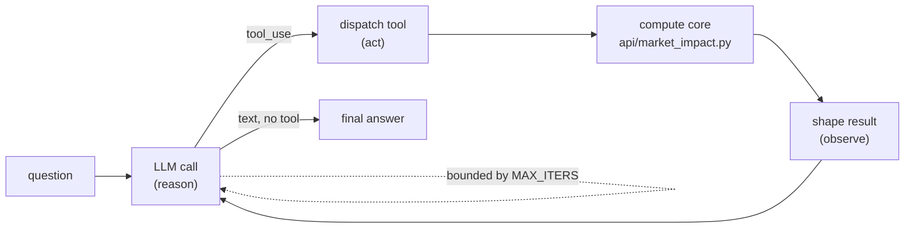

# FrontierView Agent — Technical Write-up

> **What this is.** The long-form *what / how / why* of the FrontierView agent: a
> hand-rolled LLM tool-use agent that answers equity-execution questions by
> calling FrontierView's own market-impact compute core. Companion to
> [`ARCHITECTURE.md`](../../ARCHITECTURE.md) (how the system is structured and
> served) and [`ROADMAP.md`](ROADMAP.md) (the locked decisions and phase plan).
> This document consolidates those decisions into a narrative; it is the
> long-form linked from the FrontierView project page.

---

## What it is

The FrontierView agent answers natural-language questions about equity execution
cost by reasoning over FrontierView's market-impact model. A user asks something
like *"What does it cost to work a 200,000-share AAPL order over two hours, and
how does that split between temporary and permanent impact?"* The agent decides
which model functions to call, calls them, reads the results, and writes back a
grounded answer — streaming the full tool-call trace as it goes, so the demo is
a *watch-it-think* experience rather than a black box.

Two properties make it more than a chat wrapper around a calculator:

1. **It calls the same compute the website uses.** The agent's tools import
   [`api/market_impact.py`](../../api/market_impact.py) and
   [`api/parameters.py`](../../api/parameters.py) directly and run them
   in-process. There is no second model, no re-implemented formula, no
   parallel "agent version" of the math that can drift. The numbers the agent
   quotes are the numbers the site computes, by construction.
2. **Its behaviour is measured, not asserted.** A three-layer offline eval
   harness scores answer correctness against deterministic ground truth, checks
   the tool-call trace structurally, and runs an LLM-as-judge against an
   anchored rubric. Because the model underneath is deterministic, "correct"
   is a number the harness can compute, not a matter of opinion.

### Capabilities

The agent exposes eight read-only tools, each a thin wrapper over a compute-core
function:

| Tool | What it answers |
|------|-----------------|
| `cost_and_variance` | Expected cost (bps) and variance for a given order under a named schedule, with the temporary / permanent / spread decomposition. |
| `optimal_schedule` | The cost-minimising trajectory for a risk-aversion `lambda`. |
| `compare_schedules` | TWAP vs front/back-loaded vs AC-optimal for the same order. |
| `efficient_frontier` | The cost–risk frontier across a `lambda` sweep. |
| `sweep` | Sensitivity of cost to a swept parameter (order size, horizon, volatility regime). |
| `list_symbols` | The symbol universe. |
| `get_symbol_reference` | Stored reference values (ADV, volatility, spread) for one symbol. |
| `describe_model` | The model's structure and assumptions, in prose. |

Every tool is read-only — the agent observes the model, it never mutates state.
That is what makes a public demo defensible: there is nothing for a prompt to
make the agent *do*, only things to make it *ask*.

The agent runs in two surfaces. The **CLI** is the primary developer surface and
the one the eval harness drives. The **public demo** is a guarded web surface: a
bounded set of curated questions, an ID-based request contract with no free-text
field, a per-IP rate limiter, and a hard spend cap at the API-key level. The CLI
came first; the public surface is deliberately the smaller, more constrained
thing built on top of it.

### The model underneath

The agent's correctness claims only mean something if the model it reasons about
is itself sound, so a short primer is warranted.

FrontierView computes pre-trade impact using the empirical model of **Almgren,
Thum, Hauptmann & Li (2005), *Direct estimation of equity market impact***.
Temporary impact follows a **power law in trade rate with exponent 0.6**;
permanent impact is **linear (β = 1)**, the form required by the Huberman–Stanzl
no-arbitrage argument and adopted in the 2005 calibration. The per-symbol
coefficients (η ≈ 0.142, γ ≈ 0.314 at the reference calibration) live in
[`api/parameters.py`](../../api/parameters.py) as the single source of truth for
the whole system.

One subtlety matters for reading the charts honestly, and the write-up names it
explicitly because it is exactly the kind of thing a careless implementation
gets wrong. FrontierView also plots an **"AC-optimal" trajectory**. That curve is
the *closed-form* optimal schedule from **Almgren–Chriss (2001)**, which is
derived under a **linear** temporary-impact assumption, evaluated against the
0.6 power-law cost. Because the closed form is optimal only under its own linear
assumption, it is **deliberately sub-optimal when scored under the concave 0.6
model** — the gap between it and the true frontier is a *correct* property of the
comparison, not a defect to be "fixed". The 0.6 exponent applies to temporary
impact only; permanent impact stays linear. Encoding that distinction precisely
— in the model, in the agent's `describe_model` text, and in the eval rubric — is
part of the point of the project.

---

## How it works

The agent is a small, self-contained reason–act–observe loop with no agent
framework underneath it. Everything below is hand-rolled; the dependencies are
the Anthropic SDK, Pydantic, and FastAPI, nothing more.



### The loop

[`agent/loop.py`](../loop.py) runs the cycle: send the conversation to the model,
inspect the response, and branch. If the model emits a `tool_use` block, the loop
dispatches the named tool, appends the result, and goes round again. If the model
emits text with no tool call, that text is the final answer and the loop ends.
The loop is bounded by `MAX_ITERS = 8` so a confused model can't spin forever, and
carries a duplicate-call guard so it doesn't burn iterations re-asking the same
question with the same arguments.

The model is **Claude Haiku 4.5**, with `MAX_TOKENS = 4096` per turn — see
[`agent/config.py`](../config.py). Haiku is fast and cheap enough to run a live
demo on, and — the deciding factor — it is the model the eval baseline was
measured on, so the behaviour visitors see matches the numbers the harness
reports.

### The provider seam

All coupling to a specific LLM vendor lives in **one file**,
[`agent/llm.py`](../llm.py). It is the only module that imports `anthropic`,
the only place prompt caching is applied, and the only place provider-specific
error classes are translated into the agent's own provider-agnostic signals
(notably mapping retry-exhausted 429-class errors to a `ProviderBudgetError`
that the rest of the code reacts to without knowing what raised it). Swapping the
hosted brain is therefore a one-file change plus the model id in `config.py`; the
loop, the tools, and the eval harness never learn the vendor's name.

### Tools as in-process calls

Each of the eight tools is a function that validates its arguments, calls the
corresponding compute-core function in-process, and returns a structured result.
There is no subprocess, no HTTP hop, no copied formula. The binding between a
tool and the model function it wraps is **enforced by an equality test**: the
test imports both the tool's ground-truth path and the live compute function and
asserts they agree, so a refactor that silently forks the math fails CI rather
than shipping a divergent agent. DRY here is a *structural invariant*, not a
convention someone has to remember.

### Two-part tool results

Tool results are split. The model sees a **compact in-band summary** — scalars
and the cost decomposition (`temporary_bps`, `permanent_bps`, `spread_bps`,
`total_bps`), and the echoed input parameters. The **bulky arrays** — per-bin
schedules, full frontier curves — go to a **UUID-keyed out-of-band detail store**
and never re-enter the transcript. This keeps the context small (the model
reasons over a few numbers, not hundreds of grid points) and keeps the streaming
contract clean: `tool_result` events stream the summary only.

It also turns out to be the hook the UI hangs charts on. The public tab plots the
decomposition straight from the summary, and for curves it re-derives the arrays
by calling FrontierView's *existing* `/analyse` and `/api/regime-frontier`
endpoints with the *same parameters the agent used* (carried on the `tool_call`
event). The chart numbers agree with the agent because both paths go through the
same compute core — no new HTTP surface, no detail-store leak.

### Context management and compaction

For long conversations [`agent/compaction.py`](../compaction.py) compacts the
transcript once it crosses a token threshold (≈ 6,000 tokens), replacing older
turns with a running-state summary that preserves established facts (which
symbol, which order, which numbers have already been computed) so the model
doesn't lose the thread or re-derive what it already knows. The detail store
keeps large payloads out of the window in the first place, so compaction is
rarely the first line of defence — but it's there for the cases that need it.

### Error handling — two surfaces

Errors are routed to **two different audiences**, which is the single most
important design decision in the scaffolding. A **tool error** — bad arguments,
an out-of-domain request — is handed *back to the model* as an observation, so
the model can read the error and correct itself on the next turn. A **loop
error** — something the model can't fix — escapes to the *harness*. Retries use
backoff; each surface has its own budget. Phase 4b added a third terminal flavour,
`kind="budget"`, for the case where the provider's own spend cap has been hit:
the retry-exhausted 429-class error is classified at the `llm.py` seam and
surfaced as a friendly "monthly cap reached" message rather than a stack trace.

### Schemas — one source

Each tool has exactly one **Pydantic** model. The JSON schema advertised to the
model is *generated from* that Pydantic model, and the same model *validates*
the model's tool-call arguments at dispatch. A contract test asserts
advertised == validated, so the description the model is given and the validation
it is held to can never drift apart.

### Prompt caching

[`agent/llm.py`](../llm.py) marks the stable prefix — the system block and the
tool definitions — with ephemeral `cache_control`. Because the prefix ordering is
deterministic, the cache hits turn-over-turn within a run, cutting cost and
latency on the parts of the prompt that never change.

### Streaming — SSE via an event-sink

The loop is synchronous and has no idea it's being streamed. Streaming is added
by an **optional `event_sink`**: when it's `None` (CLI, eval harness) the loop's
behaviour is byte-identical to the non-streaming path; when a sink is supplied,
the loop emits structured events through it. The web path runs the synchronous
loop on a **blocking worker thread** and bridges its events to an async response
through a thread-safe queue (`call_soon_threadsafe`) with a sentinel guaranteed
in `finally`.

The transport is **Server-Sent Events** over a `POST /agent` endpoint, consumed
by the UI via `fetch` + `ReadableStream` (not native `EventSource`, which is
GET-only). Each frame is `event: <type>\ndata: <json>\n\n`, with `type`
duplicated *inside* `data` so a stream client can dispatch on the JSON alone; a
15-second keepalive fires on idle. Crucially, **every** stream terminates with a
uniform `run_finished` event — on success (`… → final_answer → run_finished`), on
a loop error, and on a budget error alike — so the client has exactly one signal
that means "the run is over", regardless of how it ended. The bridge is also
cancellation-aware: if the client disconnects, the response generator sets a flag
the worker polls each iteration, so an abandoned run stops spending model turns at
the next boundary rather than billing a full loop to a browser tab that has gone
away (the in-flight model call can't be interrupted, but the next one isn't made).
A representative run:

```
run_started    {seq:0, config_summary:{model:"claude-haiku-4-5-…", max_iters:8}, question:"…"}
tool_call      {seq:1, name:"cost_and_variance", input:{symbol:"AAPL", order_size:200000, horizon_hours:2, schedule_type:"twap"}}
tool_result    {seq:2, name:"cost_and_variance", summary:{expected_cost_bps:2.28, decomposition:{temporary_bps:1.46, permanent_bps:0.53, spread_bps:0.30, total_bps:2.28}, …}}
assistant_text {seq:3, text:"…"}
final_answer   {seq:4, answer:"…"}
run_finished   {seq:5, turns:2, usage:null}
```

### The public surface — guardrails

The public endpoint is gated behind `AGENT_PUBLIC_ENABLED` (default off), so the
code can live on `master` without exposing a cost-bearing surface before the
guardrails are in place. The guardrails themselves are layered:

- **No free-text channel.** The request body is a Pydantic model with
  `extra="forbid"` accepting only `{question_id}`. There is no field a free-text
  prompt can travel in — the injection surface is *zero by construction*, not
  filtered.
- **Curated questions, single-sourced.** The allowlist of ~20 questions is
  imported from the eval curated set, so the demo questions and the evaluated
  questions are the same objects, kept in lockstep by a DRY equality test.
- **Per-IP rate limiting** (5/min, 50/day) for UX throttling.
- **A hard spend cap at the key/workspace level** — a dedicated
  `frontierview-public` Anthropic workspace with a low monthly limit, its key set
  on the Render service. This is the *real* financial backstop: Render's
  ephemeral filesystem and idle spin-down make any in-app counter unreliable, so
  the cap lives where state actually persists. In-app rate limiting is UX only;
  the workspace cap is the thing that genuinely can't be exceeded.

### The eval harness — three layers

The harness in [`agent/eval/`](../eval/) is the project's differentiator and runs
entirely offline, out of the request path. It exploits the fact that the model is
deterministic to make "correct" computable.

- **Layer 1 — answer correctness.** The agent's numeric answers are checked
  against **ground truth produced by calling the FV functions in-process**. For
  `optimal_schedule`, the ground-truth path is pinned to the live tool by an
  equality test, so the check can't quietly grade against a stale formula.
- **Layer 2 — trace checks.** Deterministic, structural assertions over the
  tool-call trace: did the agent call the right tool, with arguments consistent
  with the question, honouring alternatives where more than one path is
  acceptable. A **groundedness** check confirms the agent's stated numbers are
  supported by the summaries it actually saw — restricted to pairwise sums and
  differences (ratios are deliberately excluded, with an anti-leniency regression
  test guarding the exclusion) and tolerant of comma-grouped numbers.
- **Layer 3 — reasoning quality.** An **LLM-as-judge** (Claude **Sonnet 4.6**)
  scores reasoning against an **anchored rubric** whose exemplars encode the
  domain facts explicitly — the Almgren et al. (2005) citation, linear permanent
  impact at β = 1, AC closed-forms being sub-optimal under the 0.6 power-law,
  synthetic recovery being distinct from market calibration. The judge is
  **structurally blind to the Layer 1/2 outcomes** so it grades the reasoning on
  its merits rather than rationalising a known score, and it's validated with
  judge–human agreement, Cohen's κ, and self-consistency runs.

Reliability is reported as a **success rate over N = 20 runs at production
temperature** — the demo isn't sold as deterministic-on-the-LLM-side, so its
quality is stated as a rate, honestly.

---

## Why these choices

The mechanisms above each follow from a small set of principles. This section is
the rationale — the part that's meant to show judgment rather than just
execution.

**DRY as a hard constraint, enforced structurally.** The agent could trivially
have re-implemented the cost formula "for convenience". It doesn't, and the
prohibition isn't a code-review note — it's an equality test that fails the build
if the tool path and the live model path ever disagree. A portfolio piece about
an agent over a quant model is only credible if the agent and the model can't
silently diverge; encoding that as an invariant rather than a habit is the whole
argument.

**No framework — "everything hard lives in the scaffolding".** The interesting
problems in an agent are context management, tool-result shaping, error routing,
schema/validation coherence, and streaming. A framework hides exactly those
problems behind defaults. Hand-rolling the loop forces every one of them to be
decided deliberately and makes the decisions legible, which is the point of
building the thing in the first place. The cost — writing the queue bridge, the
two-surface error model, the event-sink seam by hand — is the part worth showing.

**In-process tools over copied logic.** Importing the model functions and calling
them in-process (rather than copying formulae or standing up a second service)
means there's one place a parameter changes, one place the math lives, and no
serialization boundary to keep in sync. It's also what lets the public UI's
charts agree with the agent by *re-derivation from the agent's own inputs* —
both go through `api/market_impact.py`, so agreement is structural, not a thing
that has to be tested into existence.

**A deterministic model as eval ground truth.** Most agent evals are soft because
the thing being checked is itself fuzzy. Here the model is deterministic, so the
correct answer to "what does this order cost" is a number the harness computes by
calling the same function. That converts the hardest part of agent evaluation —
"is this answer right?" — from judgment into arithmetic, and lets the LLM judge be
reserved for the genuinely subjective part (reasoning quality), with the
correctness layers underneath it and structurally hidden from it.

**Synthetic recovery is estimator behaviour, not market calibration.** FrontierView
*does* have a real fitting routine, but its calibration page demonstrates
**parameter recovery**: it generates fills from known reference η/γ and recovers
them via heteroskedastic WLS. That's a statement about the estimator, not a fit to
market data. The agent (and any future `calibrate`-style tool) must frame it that
way — as a mandatory caveat — because claiming a synthetic recovery is a live
market calibration would be a misrepresentation, and the project's credibility
rests on not making that kind of claim.

**AC schedules sub-optimal under the 0.6 power-law — a feature, not a bug.** The
"AC-optimal" frontier looks like it should be the best curve and isn't, under the
0.6 model. That's correct: the closed form is optimal only under the linear
assumption it was derived with. Encoding this in the rubric as something the agent
is *expected* to explain — rather than something to paper over — is what
distinguishes a write-up by someone who understands the model from one by someone
who wired up an API.

**Almgren et al. (2005) correctness points, encoded explicitly.** Throughout — in
`parameters.py`, in `describe_model`, in the judge rubric — the domain anchors are
written down rather than left to the model's own training: the canonical citation,
linear permanent impact at β = 1, the 0.6 exponent on temporary impact only, the
AC2001-vs-power-law distinction. The agent isn't trusted to *know* the
quant facts; the system is built so the right facts are in front of it and the
judge grades against them.

---

## What it demonstrates

The agent is small on purpose. Its value as a portfolio piece is not surface area
— it's that every hard decision in building an LLM agent over a quantitative model
was made explicitly and can be pointed at: a loop with no framework, tools that
*cannot* drift from the model they wrap, a result shape that keeps the context
lean and the stream honest, error handling that knows the difference between
"the model can fix this" and "the model can't", a streaming seam that leaves the
synchronous path byte-identical, a public surface with a zero-injection contract
and a spend cap that lives where state actually persists, and an eval harness that
turns "is the answer right" into a computation. The domain is taken as seriously
as the engineering: the model's subtleties are encoded, caveated, and graded
against, not glossed.
